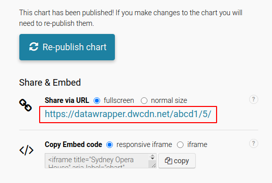

# Documentation

## How to create a element

> Audience: content editors, authors and creators

To create an element, the chart or map first needs to be created in Datawrapper

1. Sign in to your [Datawrapper account](https://app.datawrapper.de)
2. Create or find your chart / map
3. Edit the chart or map as required (refer to the Datawrapper Academy documentation for assistance)
4. Once published you will need to take the embed URL (below) and add it to the element in the CMS

## The Datawrapper URL

In the "Share & Embed" section on your chart/map:

* Check "fullscreen" next to Share via URL"
* You will see a URL like "https://datawrapper.dwcdn.net/abcd1/5/"

In the "Datawrapper" CMS element you have created, add the  URL value provided. You can right click and copy the URL then paste it in the field.

You can also select or activate the following optional fields:
- Title
- Lazy load option (this will load the iframe after other page content is loaded)
- Initial iframe height
- [Auto publish](./002_webhooks.md) option

> You do not need to copy the embed code or script, this is created for you in the CMS.

Please also complete the "Alternate content for used for assistive technologies" field as this is a WCAG requirement for accessibility.

Then save the element or, optionally, publish.

## Manually republish

When a datawrapper element is re-published due to changes, the version will increment.

To update the version on your website, simply set the "Datawrapper version" field to the version you require.

Then save the element to review changes or, optionally, publish.

See [webhook setup for options to automatically publish](.002_webhooks.md).
